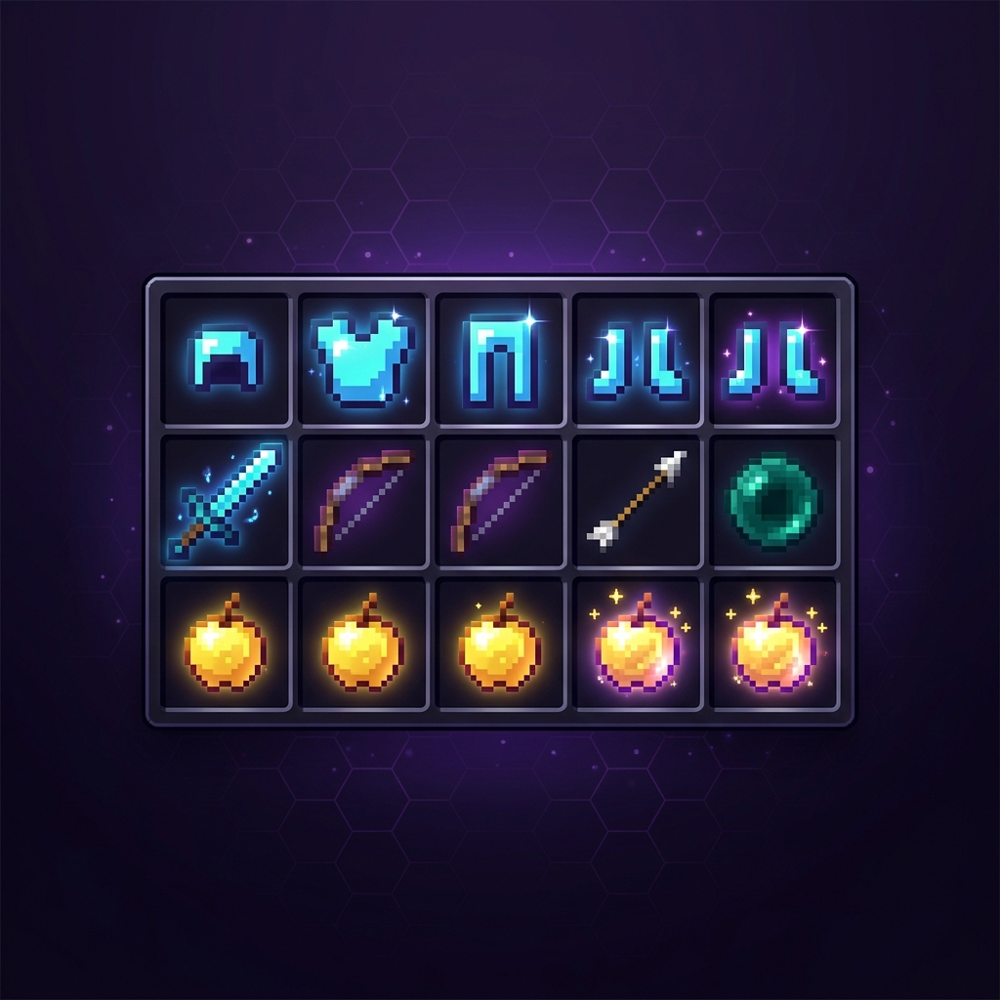

<p align="center">
  
</p>

<h1 align="center">⚔️ T-Kits</h1>

<p align="center">
  <strong>A high-performance kit management suite for Paper 1.21.x</strong>
</p>

<p align="center">
  <a href="https://github.com/takedaa83/T-Kits/actions"></a>
  
  
  
  
</p>

<p align="center">
  <sub>Built for competitive Minecraft PvP servers · Async-first · Battle-tested</sub>
</p>

---

## 📋 Table of Contents

- [Overview](#-overview)
- [Features](#-features)
- [Getting Started](#-getting-started)
- [Commands](#-commands)
- [Permissions](#-permissions)
- [Configuration](#-configuration)
- [Developer API](#-developer-api)
- [PlaceholderAPI](#-placeholderapi)
- [Architecture](#-architecture)
- [Building from Source](#-building-from-source)
- [Changelog](#-changelog)
- [License](#-license)

---

## 🔎 Overview

**T-Kits** is a production-grade kit management plugin purpose-built for competitive Minecraft PvP servers running **Paper 1.21.x**. It delivers a complete GUI-based kit editing workflow, one-click inventory regearing, cross-player kit sharing, a server-wide categorized kitroom, and a full developer API — all powered by **non-blocking async storage** with support for both YAML and MySQL backends.

Whether you're running a 10-player practice server or a 500-player competitive network, T-Kits is engineered to handle it with zero-lag kit operations, thread-safe data persistence, and graceful error recovery.

---

## ✨ Features

<table>
  <tr>
    <td width="50%">

### 🎒 GUI Kit Editor
Full drag-and-drop kit editor with armor slots, offhand, ender chest support, and stack-based navigation history. Auto-saves on close with race condition protection.

### ⚡ Instant Regear
Replenish consumed items from your kit template in a single click. Place a Regear Shulker Box or use the `/regear` command — intelligently matches items by type and metadata while ignoring durability.

### 🔄 Inventory Arrange
Re-sort your messy inventory to perfectly match your kit layout with `/arrange`. Configurable behavior for extra items: keep, drop, or move to empty slots.

</td>
<td width="50%">

### 🔗 Kit Sharing
Generate temporary alphanumeric codes to share kit configurations between players. Configurable code length, expiration time, and one-time-use toggle. Powered by `SecureRandom` for unpredictable codes.

### 🏪 Kitroom
Server-wide categorized item repository managed entirely via in-game admin GUI. Players click items to take copies. Supports per-category permissions and configurable take cooldowns.

### ⚔️ Combat Tag
Configurable combat tagging system with command blocking, ender pearl prevention, and permission-based bypass. Seamlessly integrates with all kit operations to prevent abuse during PvP.

</td>
  </tr>
</table>

### Additional Highlights

| Feature | Description |
|---------|-------------|
| 🗄️ **Dual Storage** | YAML (file-based) and MySQL with HikariCP connection pooling. Live-migrate between backends with zero downtime |
| 🔒 **Thread-Safe** | Per-player file locking, async load coalescing, and transactional MySQL batch operations prevent data corruption |
| 🧩 **Developer API** | 14-method public API registered via Bukkit `ServicesManager` for third-party plugin integrations |
| 📊 **PlaceholderAPI** | Expose kit status, combat tag state, and player data to scoreboards and chat plugins |
| 🌍 **Global Kits** | Mark kits as globally visible so all players can browse and load community loadouts |
| 🔊 **Sound Effects** | Configurable sound feedback for every action using modern namespaced keys |
| 💬 **Fully Customizable** | Every message, GUI title, button, sound, and tooltip is configurable via YAML |

---

## 🚀 Getting Started

### Requirements

| Component | Version | Required |
|-----------|---------|----------|
| Server | Paper 1.21.x (or forks: Purpur, etc.) | ✅ |
| Java | 21+ | ✅ |
| PlaceholderAPI | 2.11+ | ❌ Optional |
| MySQL | 8.0+ | ❌ Optional |

### Installation

```bash
# Option 1: Download the latest release
# → Place T-Kits-1.2.jar into your plugins/ folder

# Option 2: Build from source
git clone https://github.com/takedaa83/T-Kits.git
cd T-Kits
mvn clean package
# Output: target/T-Kits-1.2.jar
```

1. Place `T-Kits-1.2.jar` into your `plugins/` directory
2. Start the server — config files generate automatically
3. Configure `plugins/T-Kits/config.yml` to your preferences
4. Use `/kit` to open the GUI and start managing kits

### MySQL Setup

```yaml
# config.yml
storage:
  type: MYSQL
  mysql:
    host: "localhost"
    port: 3306
    database: "tkits"
    username: "your_user"
    password: "your_password"
    useSSL: false
    pool_settings:
      maximum_pool_size: 10
      minimum_idle: 5
```

Already have data in YAML? Migrate seamlessly:
```
/tkitsadmin migrate yaml mysql
```

---

## 💻 Commands

### Player Commands

| Command | Alias | Permission | Description |
|---------|-------|-----------|-------------|
| `/kit` | `/k` | `tkits.use` | Open the main kit management GUI |
| `/kit import <code>` | — | `tkits.kit.share` | Import a kit from a share code |
| `/k1` – `/k7` | — | `tkits.load.<N>` | Quick-load kit by number |
| `/regear` | `/rg` | `tkits.regear` | Get a Regear Shulker Box to replenish items |
| `/arrange` | `/ag` | `tkits.arrange` | Re-sort inventory to match kit layout |

### Admin Commands

| Command | Permission | Description |
|---------|-----------|-------------|
| `/tkitsadmin reload` | `tkits.admin` | Reload all configuration files |
| `/tkitsadmin migrate <from> <to>` | `tkits.admin` | Live-migrate data between storage backends |
| `/tkitsadmin kitroom` | `tkits.kitroom.admin` | Open the kitroom category editor |

---

## 🔐 Permissions

| Permission | Default | Description |
|-----------|---------|-------------|
| `tkits.use` | ✅ `true` | Main `/kit` command and GUI access |
| `tkits.load.1` – `tkits.load.7` | ✅ `true` | Quick-load kit shortcuts |
| `tkits.regear` | ✅ `true` | `/regear` command |
| `tkits.arrange` | ✅ `true` | `/arrange` command |
| `tkits.kit.share` | ✅ `true` | Share and import kits via codes |
| `tkits.kit.global` | ✅ `true` | Set kits as globally visible |
| `tkits.kitroom.use` | ✅ `true` | Take items from the kitroom |
| `tkits.admin` | ⛔ `op` | Administrative commands (`/tkitsadmin`) |
| `tkits.kitroom.admin` | ⛔ `op` | Edit kitroom layouts |
| `tkits.cooldown.bypass` | ⛔ `op` | Bypass all cooldown timers |
| `tkits.combattag.bypass` | ⛔ `op` | Bypass combat tag restrictions |

---

## ⚙️ Configuration

T-Kits generates three configuration files on first startup:

| File | Purpose |
|------|---------|
| `config.yml` | Storage backend, cooldowns, combat tag, sounds, messages, kit limits |
| `gui.yml` | GUI titles, button materials, names, lore, Custom Model Data, slot positions |
| `kitroom.yml` | Kitroom category data (managed via in-game GUI — avoid manual editing) |

<details>
<summary><strong>📄 config.yml — Key Options</strong></summary>

```yaml
# Storage Backend
storage:
  type: YAML  # YAML or MYSQL

# Kit Limits
kits:
  max_kits_per_player: 9
  save_on_editor_close: true
  clear_kit_requires_confirmation: true
  clear_inventory_on_load: false
  prevent_save_items:
    - "BEDROCK"
    - "COMMAND_BLOCK"
    - "BARRIER"

# Sharing
sharing:
  code_length: 5
  code_one_time_use: true
  code_expiration_minutes: 5

# Combat Tag
combat_tag:
  enabled: true
  duration_seconds: 10
  prevent_enderpearl: false
  blocked_commands:
    - "/k1"
    - "/regear"
    - "/spawn"
    - "/home"

# Cooldowns (seconds)
cooldowns:
  kit_load: 3
  regear: 10
  arrange: 5

# Regear & Arrange
regear:
  box_material: SHULKER_BOX
  box_name: "&bRegear Box &7(Place Me)"
arrange:
  handle_extra_items: "MOVE_EMPTY"  # KEEP, DROP, or MOVE_EMPTY

# Kitroom
kitroom:
  require_per_category_permission: false
  item_take_cooldown_seconds: 1
```

</details>

<details>
<summary><strong>🔊 Sound Configuration</strong></summary>

All sounds use modern namespaced keys (e.g., `entity.experience_orb.pickup`). Set any sound to `""` to disable it.

```yaml
sounds:
  gui_click: "ui.button.click"
  kit_load: "entity.experience_orb.pickup"
  kit_save: "entity.player.levelup"
  error: "entity.villager.no"
  regear_success: "entity.chicken.step"
  arrange_success: "entity.chicken.step"
  # ... and more
```

</details>

---

## 🧩 Developer API

T-Kits provides a **14-method public API** via Bukkit's `ServicesManager`:

```java
// Obtain the API instance
RegisteredServiceProvider<TKitsAPI> provider =
    Bukkit.getServicesManager().getRegistration(TKitsAPI.class);

if (provider != null) {
    TKitsAPI api = provider.getProvider();

    // ── Async Kit Retrieval (recommended) ──
    api.getPlayerKitAsync(playerUUID, 1).thenAccept(optKit -> {
        optKit.ifPresent(kit -> {
            // Process kit data off the main thread
        });
    });

    // ── Apply Kit to Player ──
    boolean loaded = api.loadKitOntoPlayer(player, 1);

    // ── Regear & Arrange ──
    api.performRegear(player);
    api.performArrange(player);

    // ── Combat Tag Integration ──
    if (api.isPlayerCombatTagged(player)) {
        long remainingMs = api.getRemainingCombatTagMillis(player);
        double seconds = remainingMs / 1000.0;
    }

    // ── Interactive Kit Selection GUI ──
    api.choosePersonalKit(player, Component.text("Pick a Kit"))
       .thenAccept(optKit -> {
           optKit.ifPresent(selectedKit -> {
               // Player selected a kit via the GUI
           });
       });

    // ── Get Regear Box Item ──
    ItemStack regearBox = api.getRegearTriggerItem();
}
```

<details>
<summary><strong>📚 Full API Reference</strong></summary>

| Method | Returns | Description |
|--------|---------|-------------|
| `getPlayerKit(UUID, int)` | `Optional<Kit>` | Get cached kit synchronously |
| `getPlayerKitAsync(UUID, int)` | `CompletableFuture<Optional<Kit>>` | Get kit from storage asynchronously |
| `getAllPlayerKits(UUID)` | `Map<Integer, Kit>` | Get all kits for a player (cached) |
| `getAllPlayerKitsAsync(UUID)` | `CompletableFuture<Map<Integer, Kit>>` | Get all kits asynchronously |
| `loadKitOntoPlayer(Player, int)` | `boolean` | Apply a kit to a player's inventory |
| `getLastLoadedKitNumber(Player)` | `int` | Get the last loaded kit number (-1 if none) |
| `getCurrentLoadedKit(Player)` | `Optional<Kit>` | Get the Kit object of the last loaded kit |
| `getGlobalKits()` | `List<Kit>` | List all globally-visible kits |
| `isPlayerCombatTagged(Player)` | `boolean` | Check if player is combat tagged |
| `getRemainingCombatTagMillis(Player)` | `long` | Get remaining combat tag duration (ms) |
| `getRegearTriggerItem()` | `ItemStack` | Get the regear shulker box item |
| `performRegear(Player)` | `boolean` | Trigger regear for a player |
| `performArrange(Player)` | `boolean` | Trigger arrange for a player |
| `choosePersonalKit(Player, Component)` | `CompletableFuture<Optional<Kit>>` | Open interactive kit selection GUI |

</details>

---

## 📊 PlaceholderAPI

> **Requires**: [PlaceholderAPI](https://www.spigotmc.org/resources/placeholderapi.6245/) (soft dependency — plugin works without it)

| Placeholder | Example Output | Description |
|------------|----------------|-------------|
| `%tkits_last_loaded_kit%` | `3` or `None` | Last loaded kit number |
| `%tkits_combat_tagged%` | `Yes` / `No` | Whether player is combat tagged |
| `%tkits_combat_tag_time%` | `4.2s` | Remaining combat tag duration |
| `%tkits_kit_<N>_exists%` | `Yes` / `No` | Whether kit N exists |
| `%tkits_kit_<N>_is_global%` | `Yes` / `No` | Whether kit N is set to global |

---

## 🏗️ Architecture

```
com.takeda.tkits
├── TKits.java                          # Plugin lifecycle & dependency wiring
├── api/
│   ├── TKitsAPI.java                   # Public API interface (14 methods)
│   └── TKitsAPIImpl.java              # API implementation
├── commands/                           # ACF-based command handlers
├── config/
│   └── ConfigManager.java             # Multi-file config loading & caching
├── listeners/
│   ├── InteractionListener.java       # Regear box placement, GUI clicks
│   └── PlayerListener.java            # Join/quit lifecycle events
├── managers/
│   ├── GuiManager.java                # GUI creation, navigation, state tracking
│   ├── KitManager.java                # Kit CRUD, loading, global cache
│   ├── KitroomManager.java           # Category-based item repository
│   ├── PlayerDataManager.java        # Async player data load/save/cache
│   ├── CombatTagManager.java         # Combat detection & command blocking
│   └── ShareCodeManager.java         # Secure code generation & redemption
├── models/
│   ├── Kit.java                        # Kit data model (Lombok @Builder)
│   ├── KitContents.java               # Serialization/deserialization
│   └── PlayerData.java               # Per-player data container
├── placeholders/
│   └── TKitsPlaceholderExpansion.java # PlaceholderAPI integration
├── services/
│   ├── CooldownService.java           # Guava cache-based cooldown tracking
│   └── UtilityService.java           # Regear/arrange execution logic
├── storage/
│   ├── StorageHandler.java            # Storage interface (CompletableFuture-based)
│   ├── YamlStorageHandler.java       # File-based storage with per-player locking
│   └── MySQLStorageHandler.java      # HikariCP-pooled MySQL with transactions
└── util/
    ├── MessageUtil.java               # Adventure API messages, sounds, colors
    ├── GuiUtils.java                  # GUI helper methods
    ├── ItemBuilder.java               # Fluent item construction API
    └── ItemSerialization.java        # Base64 item serialization
```

### Design Principles

| Principle | Implementation |
|-----------|---------------|
| **Non-Blocking I/O** | All storage operations return `CompletableFuture`; Java 21 virtual threads handle executor pools |
| **Thread Safety** | Per-player file locks in YAML; transactional rollback in MySQL; concurrent load coalescing |
| **State-Driven GUIs** | `Deque<GuiState>` per player enables back-button navigation; PDC-based action system makes click handling data-driven |
| **Graceful Degradation** | Corrupted items are skipped during serialization; failed loads return empty PlayerData instead of crashing |
| **Batched Persistence** | MySQL migrations use JDBC batch operations with transactional integrity; GUI templates are cached on reload |
| **Semantic Matching** | Item comparison ignores transient durability — worn equipment still matches its kit template |

---

## 🔨 Building from Source

### Prerequisites

- **JDK 21** or higher
- **Maven 3.8+**

### Build

```bash
git clone https://github.com/takedaa83/T-Kits.git
cd T-Kits
mvn clean package
```

The compiled plugin JAR will be at `target/T-Kits-1.2.jar`.

### Dependencies

| Library | Version | Packaging |
|---------|---------|-----------|
| [Paper API](https://papermc.io/) | 1.21.x | Provided |
| [ACF](https://github.com/aikar/commands) | 0.5.1-SNAPSHOT | Shaded |
| [AnvilGUI](https://github.com/WesJD/AnvilGUI) | 1.10.12-SNAPSHOT | Shaded |
| [Commons Lang3](https://commons.apache.org/proper/commons-lang/) | 3.14.0 | Shaded |
| [Lombok](https://projectlombok.org/) | 1.18.46 | Compile-only |
| [PlaceholderAPI](https://placeholderapi.com/) | 2.11.5 | Optional |
| [HikariCP](https://github.com/brettwooldridge/HikariCP) | 6.3.0 | Provided (MySQL) |
| [MySQL Connector/J](https://dev.mysql.com/downloads/connector/j/) | 8.0.33 | Provided (MySQL) |

---

## 📝 Changelog

### v1.2 — Stability & Performance Update
> **15 fixes** addressing data corruption, race conditions, and missing functionality

- **Critical**: Per-player YAML file locking prevents data corruption from concurrent saves
- **Critical**: Async load coalescing fixes "empty kits on join" race condition
- **Critical**: Added missing regear shell click handler — GUI clicks now actually trigger regear
- **Critical**: Sound system modernized to use namespaced keys (sounds actually play now)
- **High**: Semantic item comparison ignores durability for regear/arrange
- **High**: MySQL batch saves now properly rollback on failure
- **High**: Regear box API key aligned with listener key
- **High**: Auto-save race guard prevents stale data overwrites
- **Medium**: GUI history capped at 10 entries to prevent memory leaks
- **Medium**: Non-blocking skull texture lookups via PlayerProfile
- **Medium**: SecureRandom-based share code generation
- **Medium**: CombatTag config reload now fully propagates
- **Medium**: Graceful join errors (warns instead of kicking players)
- **Performance**: Single-pass kit serialization (eliminated double-write)
- **Performance**: O(1) regear box lookup via reverse-indexed map

### v1.1 — Initial Release
- Full GUI kit editor with 7 kit slots
- YAML and MySQL storage backends
- Regear and Arrange commands
- Kit sharing via codes
- Categorized kitroom system
- Combat tag integration
- PlaceholderAPI support
- Developer API with 14 methods

---

## 📄 License

All rights reserved. © **Takeda**

This software is proprietary. Unauthorized distribution, modification, or commercial use is prohibited without explicit written permission from the author.

---

<p align="center">
  <sub>⚔️ Built for competitive Minecraft PvP servers · Crafted with ❤️ by <strong>Takeda</strong></sub>
</p>
